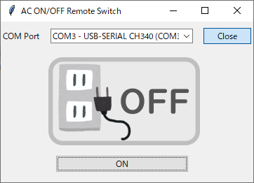
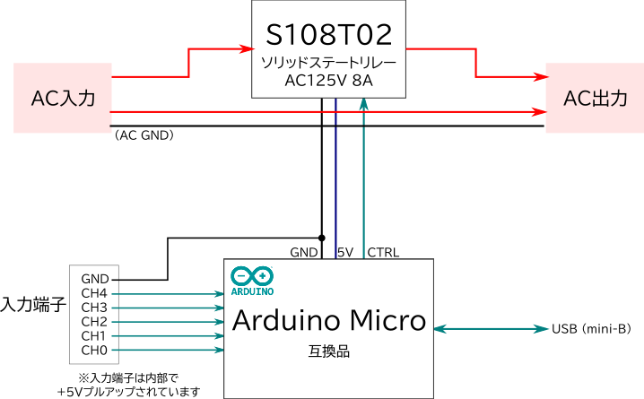

# AC ON/OFF Remote Switch

PCとUSBで接続し、Teraterm等からACをON/OFFできる装置です。5chの入力があり、アラーム等の監視も可能です。

## 操作ソフトウェア

[Releaseページ](https://github.com/drmus0715/ac-switch/releases)から最新版のソフトウェアをダウンロードできます。

### 使い方

1. AC ON/OFF Remote SwitchとPCをUSB-miniBケーブルで接続します。
1. COM Portから「USB-SERIAL CH340」を選択し、`[Open]`ボタンをクリックします。
1. `[ON]`ボタンをクリックするとスイッチがONになります。

## 通信設定

|      項目      |  設定  |
| -------------- | ------ |
| 通信速度       | 115200 |
| データ         | 8bit   |
| パリティ       | none   |
| ストップビット | none   |
| フロー制御     | none   |
| 改行コード     | LF     |

## コマンド

| コマンド | 説明 |
| -------- | ---- |
| LIST     |コマンド一覧を表示|
| STAT     |`[ON|OFF]` 現在のON/OFF状態|
| ON       |`[OK|FAIL]` 電源ON|
| OFF      |`[OK|FAIL]` 電源OFF|
| GET_0    |`[HIGH|LOW]` CH0の状態|
| GET_1    |`[HIGH|LOW]` CH1の状態|
| GET_2    |`[HIGH|LOW]` CH2の状態|
| GET_3    |`[HIGH|LOW]` CH3の状態|
| GET_4    |`[HIGH|LOW]` CH4の状態|
| DEV      |デバイスの説明を表示|
| VER      |ファームウェアバージョン表示|

## ハードウェア

